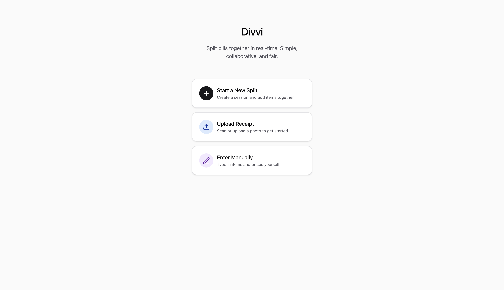
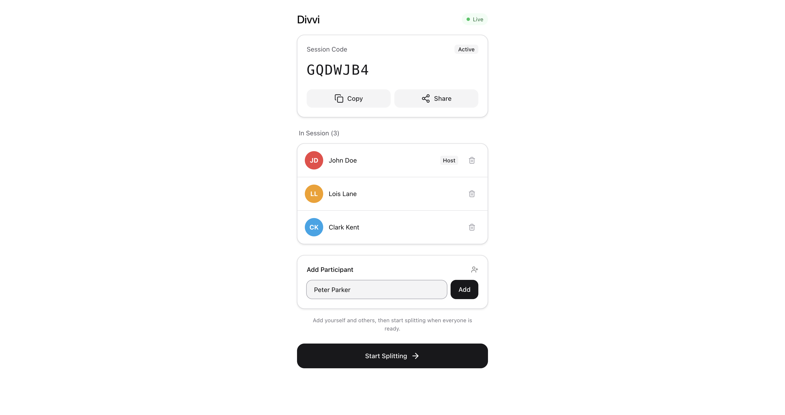
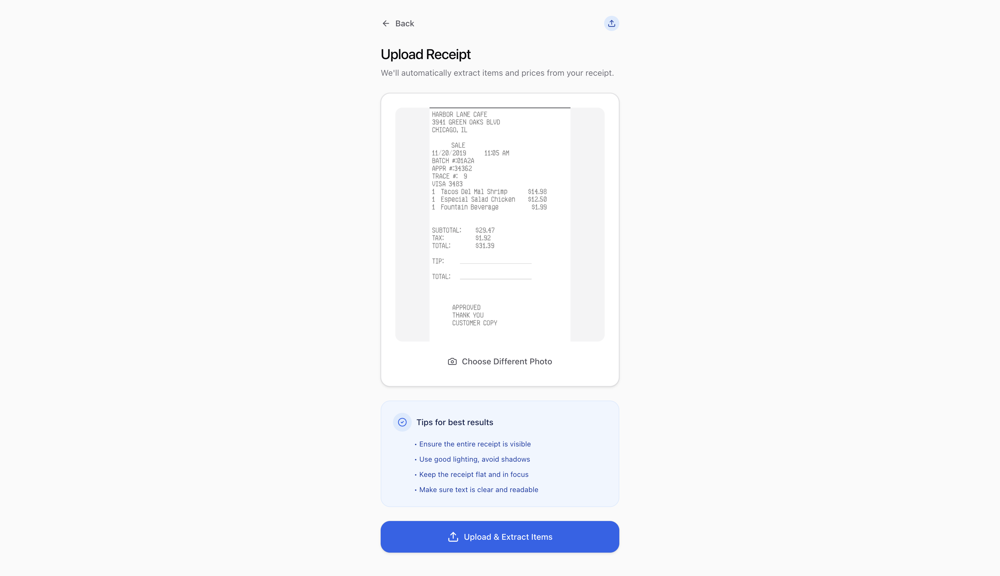
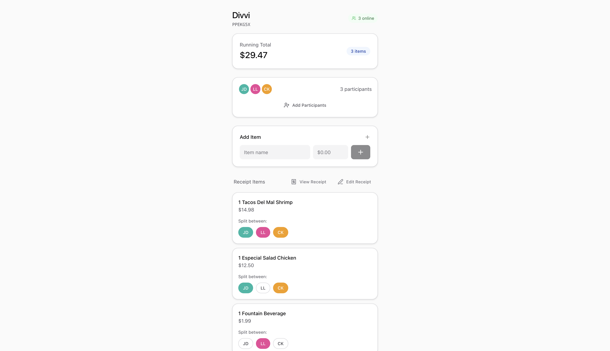
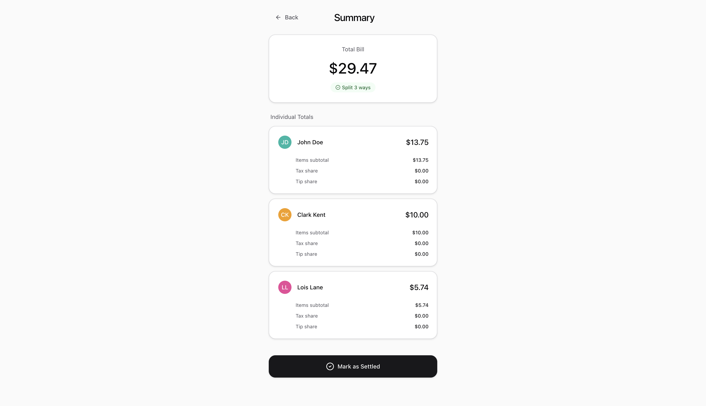
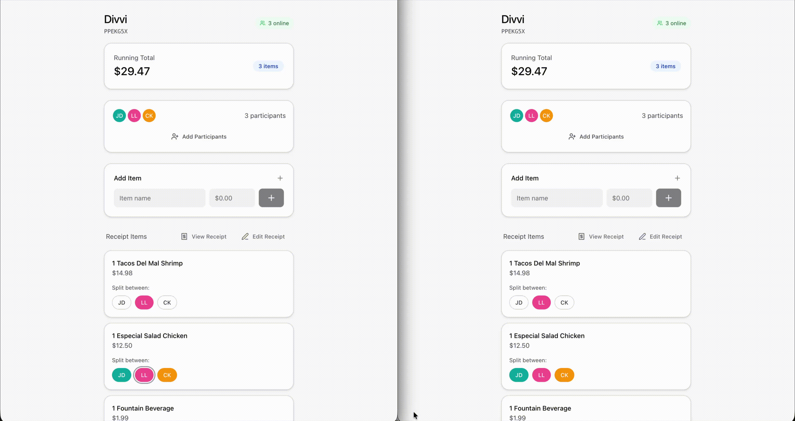

# Divvi

A real-time bill splitting app. Scan a receipt, assign items to participants, and instantly see who owes what — no account required.

🚀 Live Demo: https://divvi-production.up.railway.app

## Screenshots

| | |
|---|---|
| **Landing page** | **Join a session** |
|  |  |
| **Receipt scan & item parsing** | **Item assignment** |
|  |  |
| **Live summary / totals** | **Real-time sync (multi-device)** |
|  |  |

## Features

- **Receipt scanning** — upload a photo of your receipt and items are parsed automatically via OCR
- **Real-time sync** — all participants see updates instantly via WebSocket (no refresh needed)
- **Item assignment** — assign individual line items to one or more people
- **Live summary** — running totals with tax and tip split automatically
- **Shareable sessions** — join via a short share code, no login required
- **Session expiration** — sessions automatically clean up after 24 hours

## Tech Stack

**Frontend**
- React 19 + TypeScript + Vite
- Chakra UI
- TanStack Query
- STOMP over WebSocket (`@stomp/stompjs`)

**Backend**
- Java 21 + Spring Boot 4
- Spring Data JPA + Hibernate
- Spring WebSocket (STOMP)
- PostgreSQL
- AWS S3 (receipt image storage)
- Google Cloud Vision API (OCR)

**Infrastructure**
- Deployed on [Railway](https://railway.app)
- Frontend and backend as separate services
- PostgreSQL managed by Railway

## Architecture

```
Browser ──── REST API ────► Spring Boot Backend ──► PostgreSQL
         └── WebSocket ──►                       └──► AWS S3 (images)
                                                 └──► Google Vision API (OCR)
```

Sessions are identified by a short share code. Multiple users join the same session and receive live updates via a STOMP WebSocket topic (`/topic/sessions/{shareCode}`).

## Local Development

### Prerequisites

- Node 18+
- Java 21
- PostgreSQL running locally
- AWS credentials with S3 access
- Google Cloud service account with Vision API enabled

### Backend

```bash
cd backend
```

Create `src/main/resources/application-local.yaml` (gitignored) with your local overrides, or set environment variables:

```
PGHOST=localhost
PGPORT=5432
PGDATABASE=divvi
PGUSER=your_user
PGPASSWORD=your_password
AWS_REGION=us-east-1
AWS_S3_BUCKET=your-bucket
FRONTEND_ORIGIN=http://localhost:5173
GOOGLE_APPLICATION_CREDENTIALS=/path/to/service-account.json
```

```bash
./mvnw spring-boot:run
```

Backend runs on `http://localhost:8080`.

### Frontend

```bash
cd frontend
npm install
```

Create a `.env.local` file:

```
VITE_API_BASE_URL=http://localhost:8080/api
```

```bash
npm run dev
```

Frontend runs on `http://localhost:5173`.

## Environment Variables

### Backend (Railway)

| Variable | Description |
|---|---|
| `PGHOST` | Postgres host |
| `PGPORT` | Postgres port |
| `PGDATABASE` | Postgres database name |
| `PGUSER` | Postgres user |
| `PGPASSWORD` | Postgres password |
| `AWS_REGION` | AWS region for S3 |
| `AWS_S3_BUCKET` | S3 bucket name for receipt images |
| `FRONTEND_ORIGIN` | Frontend URL for CORS (e.g. `https://your-app.up.railway.app`) |
| `GOOGLE_APPLICATION_CREDENTIALS_JSON` | Full JSON contents of GCP service account key |

### Frontend (Railway)

| Variable | Description |
|---|---|
| `VITE_API_BASE_URL` | Backend API URL (e.g. `https://your-backend.up.railway.app/api`) |

## Deployment

The app is deployed on Railway with three services:

1. **Postgres** — managed Railway PostgreSQL instance
2. **endearing-education** — Spring Boot backend, built from `./backend`
3. **divvi** — React frontend, built from `./frontend`

The backend's `PGHOST`, `PGPORT`, `PGDATABASE`, `PGUSER`, and `PGPASSWORD` are set as Railway variable references pointing to the Postgres service.

> **Note:** `VITE_API_BASE_URL` is baked into the frontend bundle at build time — changes to it require a full redeploy (not just a restart).
